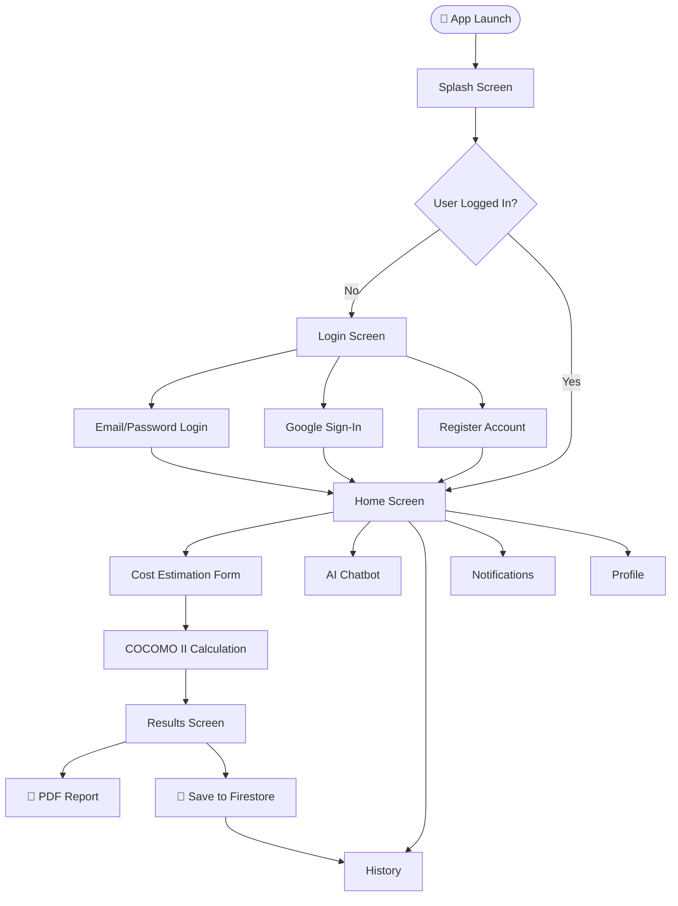
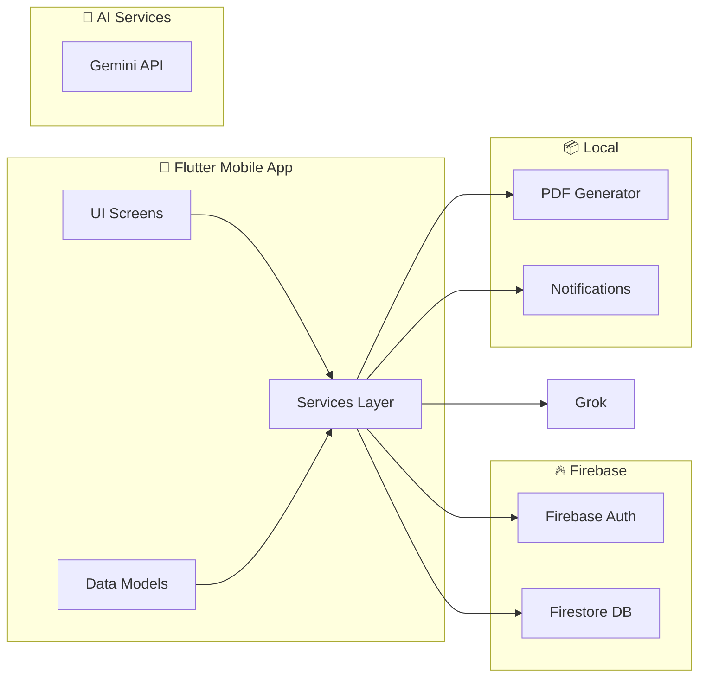
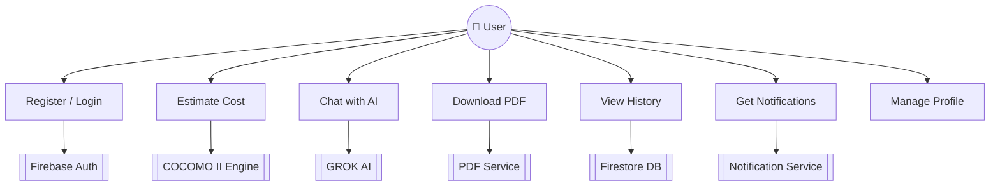

# 🔧 MaintainIQ — Software Maintenance Cost Estimator

**MaintainIQ** is a professional Flutter-based mobile application that estimates annual software maintenance costs using the **COCOMO II mathematical model** for systems operating 5+ years.

---

## ✨ Features

- 📊 **Cost Estimation** — COCOMO II mathematical model
- 🤖 **AI Chatbot** — Grok AI (Urdu & English)
- 📄 **PDF Report** — Professional downloadable report
- 🔔 **Real-time Notifications** — Instant alerts
- 🔐 **Firebase Authentication** — Email & Google Sign-In
- 📁 **Estimation History** — Firebase Firestore
- 👤 **User Profile** — Account management
- 🌙 **Modern UI** — Purple glassmorphism design

---

## 🚀 Tech Stack

| Layer | Technology |
|-------|-----------|
| **Frontend** | Flutter (Dart) |
| **Authentication** | Firebase Auth |
| **Database** | Firebase Firestore |
| **AI Chatbot** | Grok API |
| **PDF Generation** | Flutter PDF Package |
| **Notifications** | Flutter Local Notifications |
| **Model** | COCOMO II |

---

## 📐 Mathematical Model

```
Annual Maintenance Cost = 
  Dev Cost × Base Rate × Size Factor × Age Factor × Inflation

Base Rate   = 15% + (Complexity × 2.5%) + (TechDebt × 3%)
Size Factor = Small=1.0 | Medium=1.3 | Large=1.6 | Enterprise=2.0
Age Factor  = 1.0 + (Age × 0.04) per year
Inflation   = 3% per year compounded
```

---

## 🗺️ App Flow Diagram



---

## 🏗️ Architecture Diagram



---

## 👥 Use Case Diagram



---

## 📁 Project Structure

```
maintainiq/
├── lib/
│   ├── main.dart
│   ├── constants/
│   │   ├── colors.dart
│   │   └── strings.dart
│   ├── models/
│   │   ├── user_model.dart
│   │   └── estimation_model.dart
│   ├── services/
│   │   ├── auth_service.dart
│   │   ├── firestore_service.dart
│   │   ├── gemini_service.dart
│   │   ├── cost_calculator.dart
│   │   ├── notification_service.dart
│   │   └── pdf_service.dart
│   └── screens/
│       ├── auth/
│       │   ├── login_screen.dart
│       │   └── register_screen.dart
│       ├── splash_screen.dart
│       ├── home_screen.dart
│       ├── estimation_screen.dart
│       ├── result_screen.dart
│       ├── chatbot_screen.dart
│       ├── history_screen.dart
│       ├── notifications_screen.dart
│       └── profile_screen.dart
└── pubspec.yaml
```

---

## 🛠️ How to Run

**1. Clone the Repository:**
```bash
git clone https://github.com/bushra-waseem/MaintainIQ.git
cd MaintainIQ
```

**2. Install Dependencies:**
```bash
flutter pub get
```

**3. Firebase Setup:**
- Create project at [console.firebase.google.com](https://console.firebase.google.com)
- Enable Authentication (Email + Google)
- Enable Firestore Database
- Download `google-services.json` → place in `android/app/`
- Run `flutterfire configure`

**4. Add API Key:**
```dart
// lib/constants/strings.dart
static const geminiApiKey = 'YOUR_GEMINI_API_KEY';
```

**5. Run:**
```bash
flutter run
```

---

## 📲 Download APK

> [⬇️ Download MaintainIQ.apk](https://github.com/bushra-waseem/MaintainIQ/releases/download/v1.0.0/MaintainIQ.apk)

---

## 👩‍💻 Developer

**Bushra Waseem**

[](https://www.linkedin.com/in/bushraa-waseem)
[](https://github.com/bushra-waseem)

---

> Built with 💜 Flutter | Firebase | Grok AI
